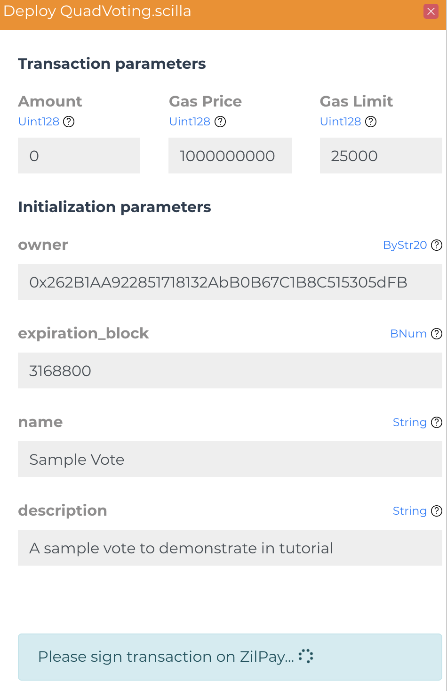
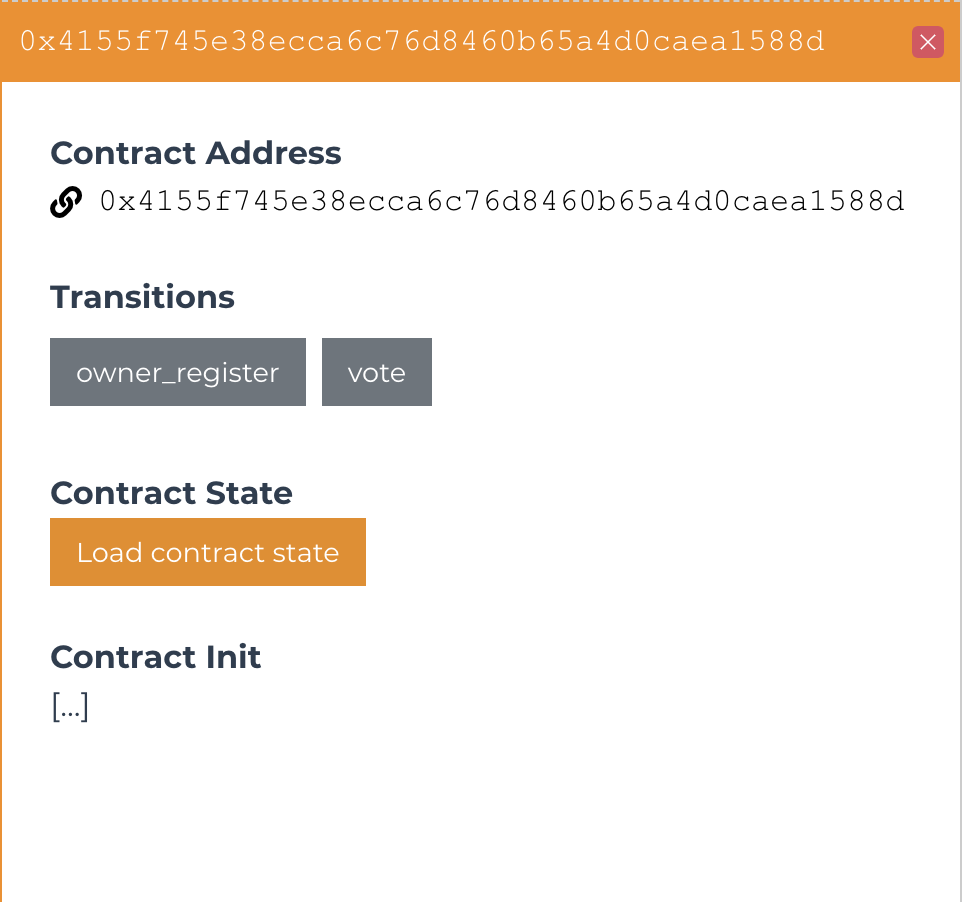
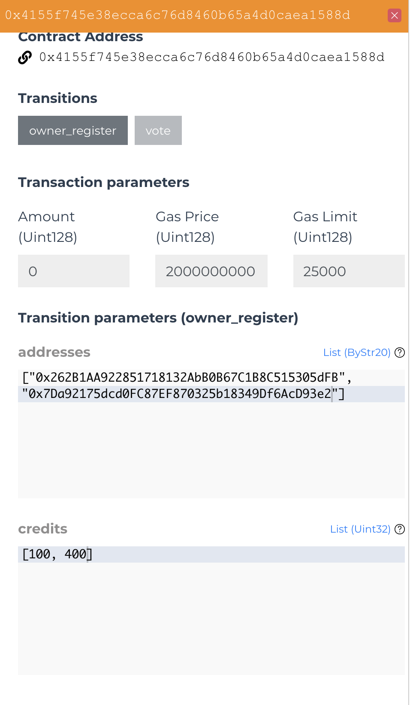
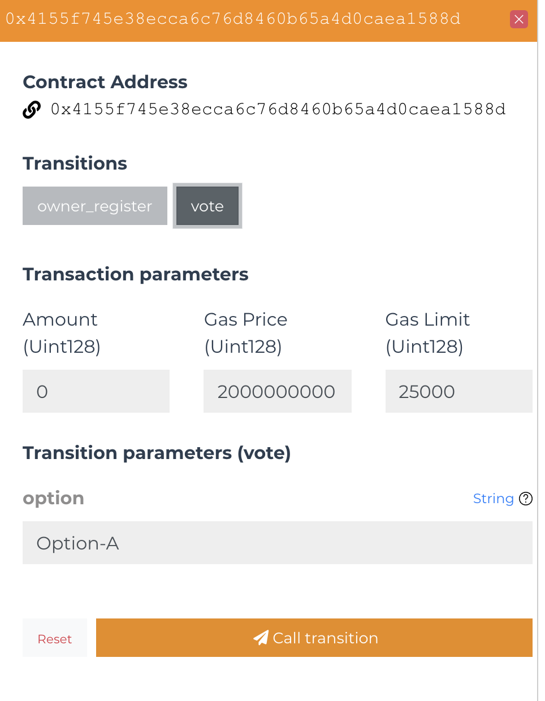

# QVote
Quadratic voting is a collective decision-making procedure that involves voters allocating their votes not just for their preference but also represent their degree of preference. It helps to protect the interest of the small group of voters that really care about the particular issue. Have you ever faced the problem with whales swinging the voting results because they have more tokens? Quadratic voting solves this problem.

## Steps to run the QVote contract

- Copy the contract to [Scilla IDE](https://ide.zilliqa.com/)

- Compile the contract with the ``Check`` button on top left side of the IDE.

- Select the network and address through which you want to deploy the contract in top right section of the IDE

- Hit deploy and a box will appear for you to pass arguments to the constructor. Enter the ``owner`` address of the contract, blocktime of the ``voting expiration`` (You can go to [Viewblock](https://viewblock.io/zilliqa) to see the recent blocktime.), ``name`` of the proposal and ``description``.

- After the transaction is successful, you can see the contract instance in bottom left of the IDE in ``CONTRACTS`` section. After you click that, a box will appear through which you can interact with the contract.

- Through the wallet which you chose as owner of the contract, register the users who can vote in the proposal using ``owner_register`` transition. You will need to pass the users wallet address in addresses list and their credits in credits list.

- Now the users who were registered can vote to the proposal, they can simply pass the option in which they want to vote.

Note: Please notice that the vote of the individual users are quadratic. You can have a look at the contract's state itself to find the allocated credit and the voting power of the user after they have voted. Please refer to ``State`` section in one of the deployed contract in testnet: [QVote Testnet](https://devex.zilliqa.com/address/0xa5221cbbbd2f233b0c60244b5f9321bd1a56c4a0?network=https://dev-api.zilliqa.com)